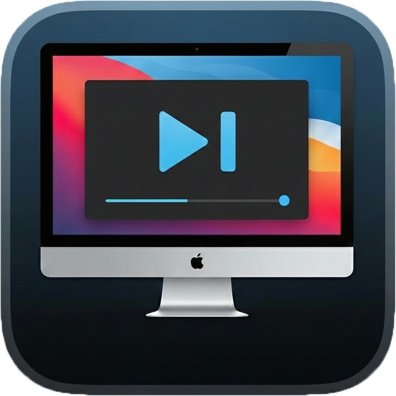
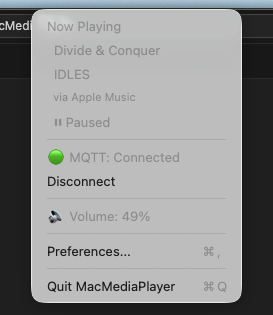
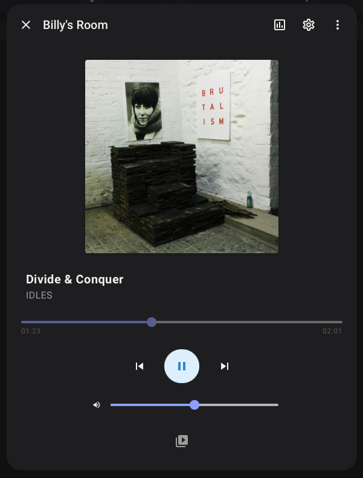

# MacMediaPlayer

<p align="center">
  
</p>

<p align="center">
  A lightweight macOS menu bar app that exposes your Mac as a <code>media_player</code> entity in Home Assistant via MQTT.
</p>

<p align="center">
  
</p>

<p align="center">
  
</p>

## Features

- Real-time Now Playing info (track, artist, album, app)
- Volume control and playback control from Home Assistant
- Works with any audio source (Apple Music, Spotify, YouTube, etc.)
- Lightweight menu bar app, no dock icon

## Use Case: Voice Assistant Audio Ducking

If you have a **Voice Preview Edition (VPE)** or any Assist satellite in the same room as your Mac, this app lets Home Assistant automatically lower your Mac's volume when the voice assistant is listening, then restore it when done.

Use the [HA Voice room MP volume blueprint](https://my.home-assistant.io/redirect/blueprint_import/?blueprint_url=https%3A%2F%2Fgithub.com%2Fluka6000%2Fhass-workshop%2Fblob%2Fmain%2Fblueprints%2FHA_Voice_room_MP_volume.yaml) to set this up.

## Requirements

- macOS 13.0+
- [media-control](https://github.com/ungive/mediaremote-adapter) CLI tool
- MQTT broker (e.g., Home Assistant MQTT add-on)
- [MQTT Media Player](https://github.com/bkbilly/mqtt_media_player) HACS integration (HA doesn't natively support MQTT discovery for media_player)

## Installation

### Homebrew (Recommended)

```bash
brew tap notownblues/ha-mac-media-player
brew install macmediaplayer

# Install required dependency
brew tap ungive/media-control
brew install media-control
```

### From Source

```bash
git clone https://github.com/notownblues/ha-mac-media-player.git
cd ha-mac-media-player
./scripts/install.sh
```

## Home Assistant Setup

1. Install [MQTT Media Player](https://github.com/bkbilly/mqtt_media_player) via HACS
2. Restart Home Assistant

## App Configuration

1. Click the menu bar icon
2. Select "Preferences..."
3. Enter your MQTT broker details (host, port, username/password)
4. Click Connect

The media_player entity will appear in Home Assistant:


```
media_player.mac_media_player_<hostname>
```

### Exposed Attributes

| Attribute | Description |
|-----------|-------------|
| `state` | playing, paused, idle |
| `volume_level` | 0.0 - 1.0 |
| `is_volume_muted` | true/false |
| `media_title` | Current track title |
| `media_artist` | Artist name |
| `media_album_name` | Album name |
| `app_name` | Source app (Spotify, Apple Music, etc.) |

### Supported Commands

| Command | Action |
|---------|--------|
| `media_play` / `media_pause` | Control playback |
| `media_next_track` / `media_previous_track` | Skip tracks |
| `volume_set` | Set volume (0.0-1.0) |
| `volume_mute` | Toggle mute |

### MQTT Topics

| Topic | Purpose |
|-------|---------|
| `homeassistant/media_player/<id>/config` | Discovery config |
| `mac_media_player/state` | Current state JSON |
| `mac_media_player/availability` | online/offline |
| `mac_media_player/set` | Commands |

## License

MIT License - see [LICENSE](LICENSE) file.
